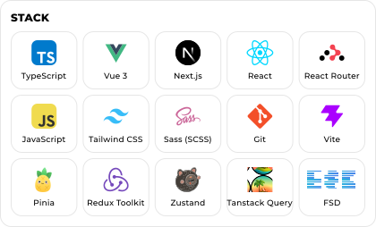

  <picture>
    <source srcset="./images/hero/hero-dark.svg" media="(prefers-color-scheme: dark)">
    <source srcset="./images/hero/hero-light.svg" media="(prefers-color-scheme: light)">
    
  </picture>
  <picture>
    <source srcset="./images/about/about-dark.svg" media="(prefers-color-scheme: dark)">
    <source srcset="./images/about/about-light.svg" media="(prefers-color-scheme: light)">
    
  </picture>
  <picture>
    <source srcset="./images/stack/stack-dark.svg" media="(prefers-color-scheme: dark)">
    <source srcset="./images/stack/stack-light.svg" media="(prefers-color-scheme: light)">
    
  </picture>
  <picture>
    <source srcset="./images/connect/connect-dark.svg" media="(prefers-color-scheme: dark)">
    <source srcset="./images/connect/connect-light.svg" media="(prefers-color-scheme: light)">
    
  </picture>

